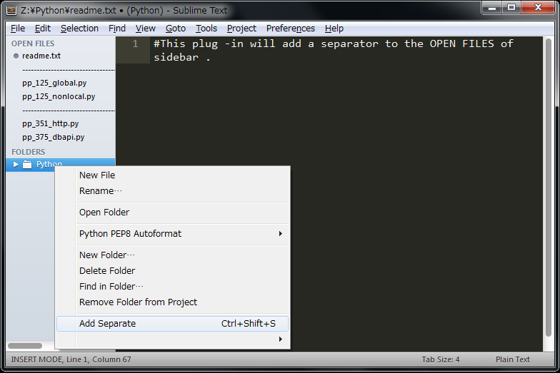

Add Separater File in Open Files List
=====================================================
Add an empty file to open files list .
It'll add a hyphen in the standard .

Usage
=====
Pressing `ctrl + shift + s` or Select the `Add Separate` the `right-click` on folders in the sidebar .

Config
=====
separate value indicates the character to be displayed as a separator .
separate_count indicates the number of separate characters .
~~~

{
   "separate_value": "-",
   "separate_count": 100,
}

~~~

License
====
This software is released under the MIT License, see LICENSE.